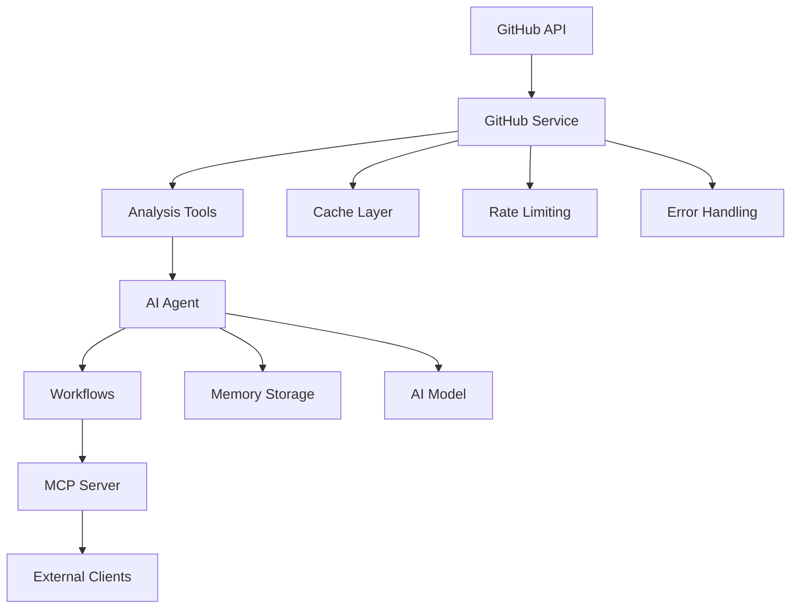

# 🚀 GitHub Partner AI

[](https://www.typescriptlang.org/)
[](https://mastra.ai/)
[](https://modelcontextprotocol.io/)
[](LICENSE)

> **Advanced AI-powered GitHub repository analysis platform with comprehensive code quality assessment, security scanning, and intelligent insights.**

## 📋 Table of Contents

- [✨ Features](#-features)
- [🏗️ Architecture](#️-architecture)
- [🚀 Quick Start](#-quick-start)
- [📖 Documentation](#-documentation)
- [🔧 Configuration](#-configuration)
- [🛠️ Development](#️-development)
- [📊 API Reference](#-api-reference)
- [🤝 Contributing](#-contributing)
- [📄 License](#-license)

## ✨ Features

### 🧠 **AI-Powered Analysis**
- **Advanced Repository Analysis**: Deep codebase structure analysis without relying on documentation
- **Intelligent Code Quality Assessment**: Comprehensive scoring with actionable recommendations
- **Security Vulnerability Scanning**: Automated detection of security issues and remediation guidance
- **Dependency Analysis**: Outdated package detection and vulnerability assessment

### 🔍 **Comprehensive Metrics**
- **Repository Statistics**: Stars, forks, activity patterns, and popularity metrics
- **Code Quality Scoring**: Multi-dimensional quality assessment with detailed insights
- **Performance Analysis**: Architecture patterns and maintainability evaluation
- **Technology Detection**: Automatic framework and library identification

### 🛡️ **Security & Quality**
- **Vulnerability Detection**: Sensitive file detection and security configuration analysis
- **Best Practice Evaluation**: Modern development practices and CI/CD assessment
- **Dependency Security**: Outdated package detection and security risk analysis
- **Compliance Checking**: License analysis and documentation completeness

### 🔌 **Integration & Extensibility**
- **Model Context Protocol (MCP)**: Standardized external tool integration
- **Multi-Account Support**: Parallel operations across multiple GitHub accounts
- **Caching & Performance**: Intelligent response caching and rate limiting
- **RESTful API**: Clean, well-documented API endpoints

## 🏗️ Architecture



### **Core Components**

| Component | Description | Key Features |
|-----------|-------------|--------------|
| **GitHub Service** | Enhanced API client | Retry logic, caching, rate limiting |
| **AI Agent** | Intelligent analysis engine | 8 specialized tools, memory persistence |
| **Workflows** | Orchestrated processes | Error handling, progress tracking |
| **MCP Server** | External integration | Standardized protocol, tool exposure |
| **Analysis Tools** | Specialized analyzers | Quality, security, metrics, dependencies |

## 🚀 Quick Start

### **Prerequisites**

- Node.js >= 20.9.0
- pnpm (recommended) or npm
- GitHub Personal Access Token

### **Installation**

```bash
# Clone the repository
git clone https://github.com/your-username/github-partner-ai.git
cd github-partner-ai

# Install dependencies
pnpm install

# Set up environment variables
cp .env.example .env
```

### **Environment Configuration**

```bash
# .env
GITHUB_USERNAME_1=your-github-username
GITHUB_TOKEN_1=your-github-token
OPENAI_API_KEY=your-openai-api-key
```

### **Development**

```bash
# Start development server
pnpm run dev

# Type checking
pnpm run typecheck

# Build for production
pnpm run build

# Start production server
pnpm run start
```

## 📖 Documentation

### **Agent Usage**

```typescript
import { mastra } from './src/mastra';

// Get the GitHub Expert Agent
const agent = mastra.getAgent('githubExpertAgent');

// Analyze a repository
const response = await agent.generate(`
  Analyze the repository "username/repo-name" and provide:
  1. Code quality assessment
  2. Security analysis
  3. Technology stack identification
  4. Improvement recommendations
`);
```

### **Workflow Execution**

```typescript
// Run comprehensive analysis workflow
const workflow = mastra.getWorkflow('comprehensiveAnalysisWorkflow');
const result = await workflow.createRunAsync({
  owner: 'username',
  repo: 'repo-name',
  includeSecurity: true,
  includeQuality: true,
  includeMetrics: true,
  includeDependencies: true
}).start();
```

### **MCP Integration**

```typescript
// Connect via MCP client
import { Client } from '@modelcontextprotocol/sdk/client';
import { StreamableHTTPClientTransport } from '@modelcontextprotocol/sdk/client/streamableHttp';

const client = new Client({
  name: 'github-ai-client',
  version: '1.0.0'
});

const transport = new StreamableHTTPClientTransport(
  new URL('http://localhost:3000/mcp')
);

await client.connect(transport);

// Use GitHub analysis tools
const result = await client.callTool({
  name: 'analyze_codebase',
  arguments: {
    owner: 'username',
    repo: 'repo-name'
  }
});
```

## 🔧 Configuration

### **GitHub Service Configuration**

```typescript
// Multi-account setup
const accounts = [
  {
    id: "account1",
    username: process.env.GITHUB_USERNAME_1!,
    token: process.env.GITHUB_TOKEN_1!,
  },
  // Add more accounts as needed
];
```

### **Caching Configuration**

```typescript
// Cache TTL (Time-To-Live)
private readonly CACHE_TTL = 5 * 60 * 1000; // 5 minutes

// Force refresh option
const repos = await githubService.getAllRepositories(true); // Bypass cache
```

### **Rate Limiting Configuration**

```typescript
// Octokit with retry and throttling
const octokit = new EnhancedOctokit({
  auth: account.token,
  throttle: {
    onRateLimit: (retryAfter, options) => {
      console.warn(`Rate limit exceeded. Retrying after ${retryAfter} seconds.`);
      return true;
    },
  },
  retry: {
    doNotRetry: ["400", "401", "403", "404", "422"],
    retryAfterBaseValue: 1000,
    retries: 3,
  },
});
```

## 🛠️ Development

### **Project Structure**

```
github-partner-ai/
├── src/
│   ├── mastra/                 # Mastra framework components
│   │   ├── agents/            # AI agents
│   │   ├── tools/             # GitHub analysis tools
│   │   ├── workflows/         # Workflow definitions
│   │   ├── mcp/              # MCP server configuration
│   │   └── index.ts          # Main Mastra instance
│   ├── lib/                   # Core library files
│   │   ├── github-service.ts  # Enhanced GitHub API client
│   │   ├── code-analyzer.ts   # Static code analysis
│   │   └── types.ts          # TypeScript definitions
│   └── examples/              # Usage examples
├── .mastra/                   # Mastra build output
├── docs/                      # Documentation
└── tests/                     # Test suites
```

### **Available Scripts**

| Script | Description |
|--------|-------------|
| `pnpm run dev` | Start development server |
| `pnpm run build` | Build for production |
| `pnpm run start` | Start production server |
| `pnpm run typecheck` | Run TypeScript type checking |

### **Code Quality**

- **TypeScript**: Full type safety with strict configuration
- **ESLint**: Code quality and style enforcement
- **Prettier**: Consistent code formatting
- **JSDoc**: Comprehensive documentation

## 📊 API Reference

### **Tools**

#### Core Operations
- `listRepositories` - Repository discovery and listing
- `analyzeCodebase` - Basic codebase structure analysis
- `createFile` - File creation and modification

#### Advanced Analysis
- `getRepositoryMetrics` - Comprehensive metrics and statistics
- `searchRepositories` - Advanced repository search and filtering
- `getCodeQuality` - Code quality assessment and scoring

#### Security & Dependencies
- `securityScan` - Security vulnerability scanning
- `dependencyAnalysis` - Dependency analysis and vulnerability detection

### **Workflows**

#### `analyzeCodebaseWorkflow`
Basic repository analysis workflow for quick insights.

#### `comprehensiveAnalysisWorkflow`
Full repository analysis including metrics, quality, security, and dependencies.

### **Agents**

#### `githubExpertAgent`
Advanced AI agent with comprehensive repository analysis capabilities.

## 🤝 Contributing

We welcome contributions! Please see our [Contributing Guidelines](CONTRIBUTING.md) for details.

### **Development Setup**

1. Fork the repository
2. Create a feature branch: `git checkout -b feature/amazing-feature`
3. Make your changes and add tests
4. Run the test suite: `pnpm test`
5. Commit your changes: `git commit -m 'Add amazing feature'`
6. Push to the branch: `git push origin feature/amazing-feature`
7. Open a Pull Request

### **Code Style**

- Follow TypeScript best practices
- Use meaningful variable and function names
- Add JSDoc comments for public APIs
- Write comprehensive tests
- Update documentation as needed

## 📄 License

This project is licensed under the ISC License - see the [LICENSE](LICENSE) file for details.

## 🙏 Acknowledgments

- [Mastra](https://mastra.ai/) - AI agent framework
- [Model Context Protocol](https://modelcontextprotocol.io/) - Tool integration standard
- [Octokit](https://octokit.github.io/) - GitHub API client
- [OpenAI](https://openai.com/) - AI model provider

---

**Made with ❤️ by [Mikias Birhanu](https://github.com/mikiasbirhanu)**

For questions, support, or collaboration, please open an issue or reach out via email.